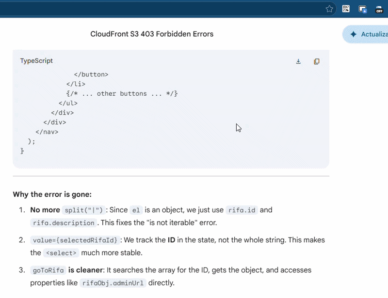

# Gemini Chat Organizer

A Google Chrome extension that converts long Gemini response messages into compact accordions, keeping your chat interface clean and navigable.

# Overview

This Chrome extension refactors the visual layout of Gemini responses. By compressing long messages into dynamic accordion components, it significantly improves readability and makes browsing chat history much faster.

⚠️⚠️⚠️ Note: The extension may experience lag. Ensure it is turned off when switching between chats.

⚠️⚠️⚠️ Disclaimer: Future Gemini website updates may cause performance issues. Please contact me if you experience persistent lag.

### Demonstration

# Motivation

When researching complex technical topics, Gemini's responses can be extremely detailed and lengthy. I found that scrolling back to review previous interactions made the chat difficult to navigate. This extension was created to manage that information overload, allowing me to view a simplified "summary view" and only expand the responses I need to reference.

# Features

* **Accordion Toggle:** Automatically wraps response elements. Click the header to expand or collapse.
* **Full Width:** The accordion expands to fill the chat container.
* **SPA Compatibility:** (Technical Note): Uses MutationObservers to stay active even when you navigate between different chats without reloading the page.

# Installation (Developer Mode)

Since this extension is in development, you must load it as an "unpacked" extension:

1.  **Download/Clone** this repository to your local machine.
2.  **Open Chrome** and navigate to `chrome://extensions`.
3.  **Enable "Developer mode"** using the toggle switch in the top right corner.
4.  Click the **"Load unpacked"** button that appears.
5.  **Select the folder** where you saved this repository (the folder must contain the `manifest.json` file).

### How to Use

Navigate to Gemini (gemini.google.com). The extension runs automatically in the background.

* Click a message header (preview text) to expand or collapse the full response.

---

*This README was last updated for Manifest V3 compatibility.*
